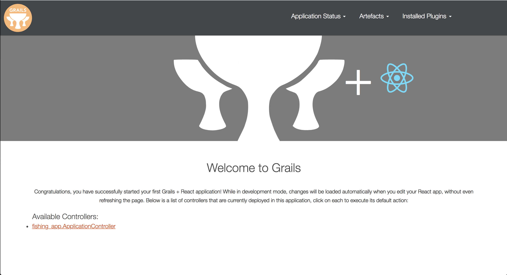
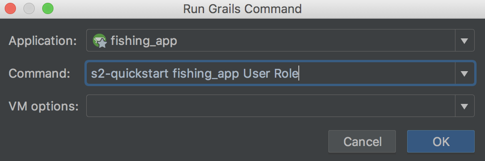
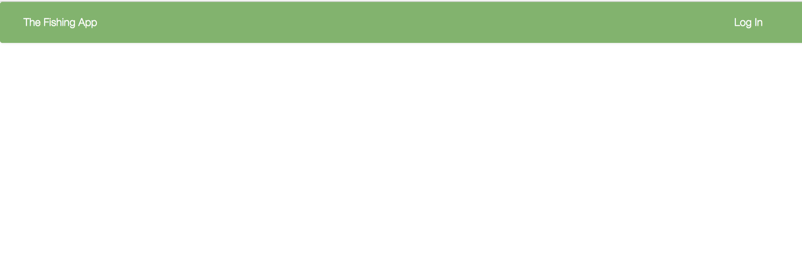
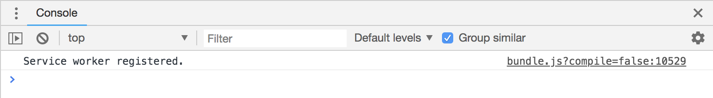
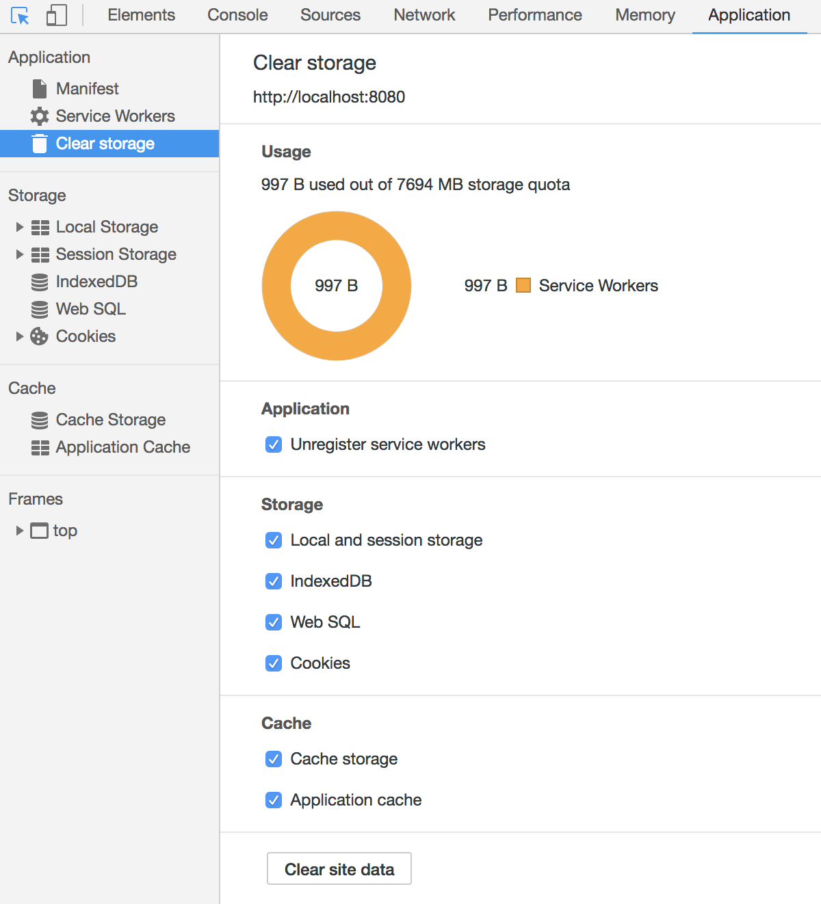
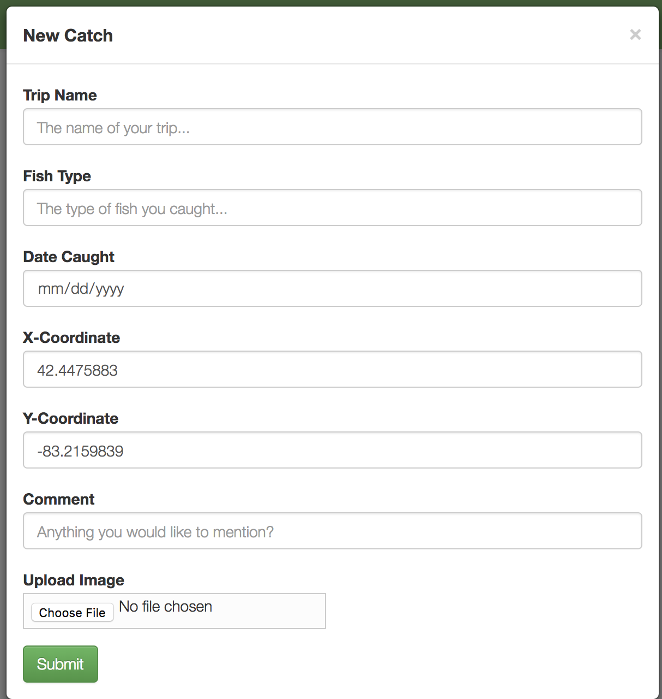

# Grails/React Offline App Tutorial
* [Introduction](#introduction)
* [Prerequisites](#prerequisites)
* [Backend](#backend)
* [Frontend](#frontend)
* [Offline Functionality](#offline-functionality)

<a name="introduction"></a>
### Introduction
This tutorial is meant to be an introduction to React, specifically building react on top of a Grails backend. It assumes little to no React knowledge, and at least cursory knowledge of Grails.

We are going to be building a [progressive web app](https://developers.google.com/web/progressive-web-apps/) that works even with no internet connection. It will be a simple fishing companion app that you would take on a fishing trip to document your catches.

We will be covering the following:

* Building a grails app
* [Spring Security](https://grails-plugins.github.io/grails-spring-security-core/snapshot/index.html)
* React components
* Using [fetch](https://developer.mozilla.org/en-US/docs/Web/API/Fetch_API) to talk to the app’s backend
* [Promises](https://developer.mozilla.org/en-US/docs/Web/JavaScript/Reference/Global_Objects/Promise)
* [ServiceWorkers](https://developers.google.com/web/fundamentals/primers/service-workers/) and [Localforage](https://github.com/localForage/localForage)

<a name="prerequisites"></a>
### Prerequisites
The first thing we are going to do is set up our development environment. Before we start, install Yarn and Node using your machine’s preferred package manager. Also, if you’re using Chrome, install React Developer Tools [here](https://chrome.google.com/webstore/detail/react-developer-tools/fmkadmapgofadopljbjfkapdkoienihi). This is an extension allowing you to view your React application and all of its states and props, which helps with debugging.

In IntelliJ, set up a new Grails project. Under options, add the flag `—profile=react-webpack`
You can learn more about Grails profiles [here](grails.org/profiles.html). For our purposes, we are building a single React app that uses Grails as a backend.


After everything is initialized, go to **build.gradle** and find the ‘node’ option. Update the values for version and yarnVersion to reflect the current versions of yarn and node respectively. At the time of writing, they are v10.2.1 and 1.7.0, but you can run `node -v` and `yarn -v` to check.

The first run will take the longest to initialize everything, so let’s get this out of the way now, as well as make sure everything is in working order. We should be greeted with this page:



Next, we need to download some node modules that our app will depend on. In the terminal in Intellij, run the command `yarn add -D localforage`.
The -D flag stands for ‘dev’, as these are developer dependencies. Refer back to list of things covered for more information on these packages. 

<a name="backend"></a>
### Backend 
The basic idea of this app is that the user catches a fish in real life. The fisher then opens the app and fills out a form detailing the catch just landed. This form data gets saved into Grails as a ‘Catch’ that can then be looked up. The backend is going to be where we house our database and user authentication. 

First, we are going to add Spring Security Core. This allows for us to authenticate users. Add this line to **build.gradle** at the end of the dependencies list after line 69.

```groovy
dependencies {
    compile "org.springframework.boot:spring-boot-starter-logging"
    compile "org.springframework.boot:spring-boot-autoconfigure"
    compile "org.grails:grails-core"
    compile "org.springframework.boot:spring-boot-starter-actuator"
    compile "org.springframework.boot:spring-boot-starter-tomcat"
    compile "org.grails:grails-web-boot"
    compile "org.grails:grails-logging"
    compile "org.grails:grails-plugin-rest"
    compile "org.grails:grails-plugin-databinding"
    compile "org.grails:grails-plugin-i18n"
    compile "org.grails:grails-plugin-services"
    compile "org.grails:grails-plugin-url-mappings"
    compile "org.grails:grails-plugin-interceptors"
    compile "org.grails.plugins:cache"
    compile "org.grails.plugins:async"
    compile "org.grails.plugins:scaffolding"
    compile "org.grails:grails-plugin-gsp"
    compile "org.grails.plugins:events"
    compile "org.grails.plugins:hibernate5"
    compile "org.hibernate:hibernate-core:5.1.5.Final"
    compile "org.grails.plugins:gsp"
    compile "org.grails.plugins:views-json"
    compile "org.grails.plugins:views-json-templates"
    console "org.grails:grails-console"
    profile "org.grails.profiles:react-webpack"
    runtime "org.glassfish.web:el-impl:2.1.2-b03"
    runtime "com.h2database:h2"
    runtime "org.apache.tomcat:tomcat-jdbc"
    runtime "com.bertramlabs.plugins:asset-pipeline-grails:2.14.8"
    testCompile "org.grails:grails-gorm-testing-support"
    testCompile "org.grails:grails-web-testing-support"
    testCompile "org.grails.plugins:geb:1.1.2"
    testRuntime "org.seleniumhq.selenium:selenium-chrome-driver:2.47.1"
    testRuntime "org.seleniumhq.selenium:selenium-htmlunit-driver:2.47.1"
    testRuntime "net.sourceforge.htmlunit:htmlunit:2.18"
    // Adds Spring Security plugin
    compile 'org.grails.plugins:spring-security-core:3.2.0'
}
```

Next, open up the Grails command window under **Tools > Grails > Run Grails Command**. 
Run this command to set up Users and User Roles, making sure to replace ‘fishing_app’ with whatever you named your project. This guide will be referring to it as ‘fishing_app’.



Open up */grails-app/conf/application.groovy*. At the bottom of the staticRules array, add these rules starting around line 18:

```groovy
[pattern: '/logout/**',      access: ['permitAll']],  // for easy access to logout
[pattern: '/catch/**',       access: ['ROLE_USER']],  // for catch controller
[pattern: '/sw.js',          access: ['permitAll']],  // for service worker
[pattern: '/User/getLogin',  access: ['permitAll']],  // to check user login info
[pattern: '/dbconsole/**',   access: ['ROLE_ADMIN']], // for access to H2 console
```

These define what user roles can access what urls. Right now, they don’t exist, but they will in a minute. At the very bottom of the file, after the chainMap array, add the line:

```groovy
grails.plugin.springsecurity.logout.postOnly = false
```

This gives the user an easier time logging out by not requiring a POST request.

Next, go to */grails-app/conf/application.yml*. In this file, we will be specifying some rules regarding uploading files. At the very top, add this resources line to the end of the block starting around line 11.

```yml
resources:
    pattern: '/**'
```

This allows us to access external files as we need them. In the second grails: block, under controllers, add this block below the `defaultScope: singleton` declaration:

```yml
    upload:
        maxFileSize: 262144000
        maxRequestSize: 262144000
```

This allows us to upload normal sized images to Grails.

Now, back to the User domain we just created. In */grails-app/domain/fishing_app/User* we are going to add a couple fields to personalize the User. Add a first and last name to the list of properties.

```groovy
String username
String password
String fname 
String lname 
boolean enabled = true
boolean accountExpired
boolean accountLocked
boolean passwordExpired
```

We are going to create a new domain now to represent the ‘Catch’ that was mentioned earlier. Create a new Grails Domain Class by right clicking the domain folder and selecting **New >**. Call it Catch. Fill it out like this:

```groovy
package fishing_app

class Catch {
    String tripName
    String fishType
    String comment
    Float xCoord
    Float yCoord
    Date dateCaught
    String image

    static belongsTo = [user: User]

    static constraints = {
        tripName blank: false
        fishType blank: false
        comment nullable: true
        xCoord nullable: true
        yCoord nullable: true
        dateCaught blank: false
        image nullable: true
    }
}
```

These fields are what the user is going to fill out in the form. Note that the constraints say that the tripName, fishType, and dateCaught cannot be blank. The other fields are optional.

These domains need controllers. The controllers are where we house the logic for the backend. The same way we made a new domain we can make new controllers. Make one for both Catch and User. 

The User controller is simple. It will contain one function that checks whether or not we are logged in.

```groovy
package fishing_app

class UserController {
    def springSecurityService

    def index() { }

    // this function checks if the user is logged in
    def getLogin() {
        User user = springSecurityService.currentUser

        if (user != null) {
            render user.fname
        }
        else {
            render false
        }
    }
}
```

The Catch controller has a couple of functions. The first function looks up all Catches made by the currently logged in User.


```groovy
import grails.converters.JSON

class CatchController {
    def springSecurityService

    def index() { }

    def getCatches() {
        User user = springSecurityService.currentUser
        render Catch.findAllByUser(user).toArray() as JSON
    }
}
```

Pay special attention to the name of the function. Remember this line that was added to **application.groovy**?

```groovy
[pattern: '/catch/**',       access: ['ROLE_USER']],  // for catch controller
```

The access key means that only users with the role **ROLE_USER** can access the catch controller, i.e. we have to be logged in. Similarly, the line 

```groovy
[pattern: '/User/getLogin',   access: ['permitAll']],  // to check user login info
```

Refers to the getLogin function in the User controller. This line means anybody can call this function, logged in or not.

In the Catch controller, add another function called newCatch. It will contain the logic for converting the form data into a Catch object to save to Grails. It will look like this:

```groovy
// Takes form parameters and saves it to the database
def newCatch() {
    User user = springSecurityService.currentUser   // get current user

    def tripName = params.tripName
    def fishType = params.fishType
    def dateCaught = params.dateCaught
    def xCoord = params.xCoord
    def yCoord = params.yCoord
    def comment = params.comment
    def image = params.image

    def dateCaughtModified = new Date().parse("yyyy-MM-dd", dateCaught)

    def destFilename
    def imageUpload = image
    def img_path = "/Desktop/directed_study/code/building/grails/fishing_app/src/main/webapp/images/uploaded"

    // if image was passed else make it null (queue sends null parameter as string)
    if (imageUpload != null && imageUpload != "null") {
        def destDir = System.getProperty("user.home") + img_path

        def id = UUID.randomUUID().toString()
        while (Catch.countByImage(id) > 0) {  // if this photo name already exist make a new one
            id = UUID.randomUUID().toString()
        }


        destFilename = String.format("%s.jpg", id)
        File destFile = new File(destDir, destFilename)

        destFile.createNewFile()
        imageUpload.transferTo(destFile)

    }
    else {
        destFilename = null
    }

    def fishCatch = new Catch(
            user: user,
            tripName: tripName,
            fishType: fishType,
            dateCaught: dateCaughtModified,
            xCoord: xCoord,
            yCoord: yCoord,
            comment: comment,
            image: destFilename,
    )

    fishCatch.save(flush: true, failOnError: true)
    render "Success!"
}
```

**NOTE: MAKE SURE YOU UPDATE img_path TO REFLECT WHERE YOUR PROJECT IS LOCATED.**

Make a new directory in */src/main/webapp/images/* called ‘uploaded’. This will be where all our uploaded images get stored. To be sure img_path is correct, just copy the absolute path of the newly created directory & use that as the value.

Finally, we will create some test data to make sure everything is in working order. In 
*/grails-app/init/fishing_app/BootStrap* add the following. The values can be replaced however you want, and additional catches can be added.

```groovy
class BootStrap {

    def init = { servletContext ->

        def today = new Date()

        // Add for creating Roles and Users
        // def adminRole = new Role(authority: 'ROLE_ADMIN').save(flush: true)
        def userRole = new Role(authority: 'ROLE_USER').save(flush: true)

        // Create the account and save it
        def testUser = new User(username: 'b', password: 'password', fname: 'Bryce', lname: 'Williams')

        testUser.save(flush: true)

        UserRole.create testUser, userRole, true
        UserRole.withSession {
            it.flush()
            it.clear()
        }

        // Create a fish and save it
        def fish = new Catch(
                tripName: "Up State",
                fishType: "Walleye",
                comment: "It was cold",
                dateCaught: today,
                xCoord: 47.1211,
                yCoord: 88.5694,
                image: "later.png",
                user: testUser
        )

        fish.save(flush:true)

    }


    def destroy = {
    }
}
```

A couple things to point out: 
* adminRole is used for administrative purposes. You can give special permissions to different roles.
* The value for the image in the catch is just a placeholder. It does not actually refer to anything.

Now, when we re-run the app, we are greeted with the same startup page. However, controller functions can be referenced as URLs. For example, let’s test the getLogin() function in the User controller. In the browser, add */user/getLogin* to the end of the url. We should be greeted with this page:   


It renders false, because we aren’t logged in. Try navigating to the `getCatches()` function in the catch controller. It’s secured, so we shouldn’t be able to, right? */catch/getCatches* will redirect us to the log in page, thanks to Spring Security.


Log in with the bootstrapped account, and we will be redirected to the correct page


Now, go back to the */user/getLogin* page. It should now show us who we’re logged in as.


That’s it for the backend. Now we have a foundation for the frontend which we will be building in React.

<a name="frontend"></a>
### Frontend
Recall the fishing scenario from earlier. The frontend is going to contain the form and all of the rest of the user interactions.

Open */src/main/webapp/App.js*. This is where we are going to build the frontend. If you study the code in the `render() { }` block, you’ll notice that this is what is being displayed when we run the app. It may look daunting at first, but React is simpler than it seems.

First, we are going to replace the Navbar with our own. We will start by replacing the App.js file with the below:

```js
import React, { Component } from 'react';
import { Button } from 'react-bootstrap';

/** components */
import AppNav from './AppNav'

import 'whatwg-fetch';


class App extends Component {
    constructor() {
        super();

        this.state = {
            online: true,
            logged_in: false,
        }
    }

    render() {
        const {
            online,
            logged_in,
        } = this.state

        return (
            <div>
                <AppNav
                    logged_in={logged_in}
                    online={online}
                />
            </div>
        );
    }
}

export default App;
```

App.js is what is known as a [React Component](https://reactjs.org/docs/react-component.html). Look at the reference for more details. The basic idea is that components can be defined as classes or functions. Components defined as classes have the constructor block and usually defines a [state](https://reactjs.org/docs/state-and-lifecycle.html). The state of a component can be thought of as a list of global variables that are immutable. If the app changes state, it must re-render to reflect those changes.
 
The block starting around line 10 is the constructor. The call to `super()` initializes the constructor so that the component can use the `this` keyword. The next line defines the state of the app. It defines two booleans: `online` and `logged_in`. `online` is going to indicate whether or not the user is online, and `logged_in`, whether or not the user is logged in. 

Every component must have a `render() { }` block. The html-esque tags in the return statement are converted to html and get displayed in the browser. Before the return statement, additional logic that controls what gets rendered can be placed here. Lines 22-25 is a shorthand way of referencing state variables. Without this, online and logged_in must be referenced using `this.state.online` and `this.state.logged_in`. Finally, the tag around line 29 is our Navbar. Lines 30 and 31 are called props. These are parameter variables passed to a component in the same way a function is called with arguments. We will touch on this more in a second.

Navigate to AppNav.js. Replace the contents with the following:

```js
import React from 'react';
import { Navbar, Nav, NavItem } from 'react-bootstrap';

import { nav_styles } from './util/Styles'

import 'whatwg-fetch';

const AppNav = props => {
    const {
        logged_in,
        online
    } = props;


    // conditionally renders login/logout link
    const nav = (link) => {
        return (
            <Navbar style={nav_styles.nav}>
                <Nav style={nav_styles.item} pullLeft>
                    <NavItem href={'/'}>
                        The Fishing App
                    </NavItem>
                </Nav>

                <Nav style={nav_styles.item_right} pullRight>
                    { /* only show login/logout button if online */
                        online &&
                        link
                    }
                </Nav>
            </Navbar>
        )
    }


    const login = <NavItem href={'/login/auth'}>Log In</NavItem>;
    const logout = <NavItem href={'/logout'}>Log Out</NavItem>;

    if (logged_in)
        return nav(logout)
    else
        return nav(login)
}


export default AppNav;
```

AppNav is a component that is defined as a function rather than a class. These are also known as [stateless](https://hackernoon.com/react-stateless-functional-components-nine-wins-you-might-have-overlooked-997b0d933dbc) functional or dumb components. They do not have as much overhead as a stateful component, and are meant to inherit state from their parent as properties. 

Before we do anything, there is some styling we need to add. The import around line 4 will be throwing an error, because that file does not exist yet. In the */src/* folder, make a directory called *util*. This is where we will be keeping extra JavaScript files that are not components. Make a JavaScript file called Styles, and fill it out like below. Then, navigate to */src/main/webapp/css/App.css* and comment everything out.

```js
/** APP */
const button = {
    margin: "5px",
    display: "flex",
    justifyContent: "center"
}

const app_styles = {
    button: button
}


/** NAVBAR */
const nav = {
    backgroundColor: "#73b566",
    backgroundImage: "none",
    marginBottom: "15px"
}

const item = {
    display: "inline-block"
}

const item_right = {
    display: "inline-block",
    float: "right"
}


const nav_styles = {
    nav: nav,
    item: item,
    item_right: item_right
}

export { app_styles, nav_styles }
```

In React, styles are declared like objects. The css properties still have the same name, except that the ones that are words separated by a dash become camelCase (`background-color` becomes `backgroundColor`). You can add styling like this, but it can be added inline as well. Check [this](https://codeburst.io/4-four-ways-to-style-react-components-ac6f323da822) article out to see more ways to style your components.

Now, back to AppNav. The first thing you may notice is the strange declaration of the function around line 8. This is called an [arrow-function](https://codeburst.io/javascript-arrow-functions-for-beginners-926947fc0cdc). The key differences between a regularly declared function and an arrow function are that arrow functions are written in a cleaner syntax, and they do not bind the keyword `this`. What that means is that any arrow function that references `this` references the original binding, and doesn’t try to look for something inside the function. This will be expanded on more as we go through the guide. Check the arrow-function link for a more in-depth explanation.

Lines 9-12 are a cleaner way to declare the props that are being passed to the component. They can be listed as separate parameters like so: 
	`const AppNav = ({logged_in, online}) => {…}`
and would change nothing about the functionality. 

Line 16-33 is the navbar itself. It is being built as a function because it contains the login/logout button. Which button gets displayed depends on the `logged_in` prop. This is called [conditional rendering](https://reactjs.org/docs/conditional-rendering.html). The link that gets passed as a parameter is going to be one of the NavItems declared on lines 36 and 37. Furthermore, we only want to display this link if the app is online, since logging in or out requires an internet connection. The block around line 26-29 is how we achieve this. It is similar to the logical `and` in other programming languages, the idea being that if the first half is true, then it will look at the second half, and skip over it otherwise. 

Finally, the line at the very bottom tells React to export the function so that it can be imported in another file.

Now, re-run the app. Our app should now look like this:



Now, try logging in. It works as expected, but now we can’t log out. This is because we never update the `logged_in` state. Back in App.js add this underneath the constructor:

```js
 /** checks for online & logged in status */
componentWillMount() {
    // check if online
    this.setState({online: navigator.onLine})

    // check if logged in
    const url = "/user/getLogin";

    fetch(url, {
        method: 'GET',
        credentials: 'same-origin',
    })
    .then(r => r.text())
    .then(text => {
        if (text === 'false'){
            this.setState({logged_in: false})
        }

        else {
            this.setState({logged_in: true})
        }
    })
}
```

`componentWillMount` is what’s called a [lifecycle function](https://reactjs.org/docs/react-component.html). They are used to update a component during a specific phase of its lifecycle. In this case, we want to check the app’s logged in status as it’s mounting so that it will be ready upon first use.

The very first thing it does is checks if the app is online. navigator.onLine is a JavaScript property that lets us know if there is a connection or not, so we will set our online state to reflect it. Then, if we are online, we can `fetch` the logged in status from Grails. [Fetch](https://developers.google.com/web/updates/2015/03/introduction-to-fetch) is similar to ajax, but it is built on [Promises](https://developers.google.com/web/fundamentals/primers/promises), which is a more simplified way of doing asynchronous tasks than callbacks. We will expound upon how to build our own Promises later. Building the request is simple: the call is `fetch(url, {options})`. The url is the same as what we manually navigated to earlier. The options we specify will be `method` and `credentials` Our method is `‘GET’` because we are retrieving information, and we set the credentials to `‘same-origin’`. 
A promise is a function that does an operation, and returns one of two functions depending on the results. If the operation succeeds, it will `resolve()`, otherwise it will `reject()`. These correspond to `.then()` and `.catch()` respectively. In our example, when fetch is called, it’s really calling the `getLogin` function in the user controller, and passing the result to `resolve()`. On line 33, `.then()` is how we retrieve the response which is what the variable `r` is. All responses from fetch come back as objects, but they can be transformed if need be. For this use, we just want the text, so we will be calling the `text()` function on the response. This returns another Promise, so we will need to use `.then()` one more time to get the text. This is called chaining promises, which can be done as many times as necessary. Doing the same thing with callbacks is possible, but infinitely more messy and harder to follow. Inside this promise resolution, we can set the `logged_in` state to reflect what Grails sees.

Re-run the app, and now the login button updates like it’s supposed to!

One last thing before we move on: Due to the nature of the app’s usage, we cannot assume the user’s internet connection will be stable. If the app thinks the user is online after they have lost connection, problems could arise. We want the app to check its online status whenever possible. Under the `componentWillMount()` function add this lifecycle function:

```js
 /** updates the online status */
componentWillUpdate() {
    // if online status was changed
    const { online } = this.state

    if (online !== navigator.onLine)
        this.setState({online: navigator.onLine})
}
```

This function gets called every time the component updates, like during a state change or a rendering of another component. It simply checks the online property against its own online state, and sets the state to match the property if it changed.


Next, we are going to add a feature to display the catches we landed, i.e. getCatches. Functionally, it will work like this: if the user is online and logged in a request can be made to Grails from React to retrieve the catches. This means we will need to keep track of the catches somehow. We would also like to be able to view the details of each catch. The workflow then is to make a fetch request to Grails, and store the catches in a table to be viewed. We will start by adding a couple more things to the state. In the constructor, add these to the state:

```js
posted_catches: [],             // catches in the database

showing_detail_modal: false,    // catch detail modal
display_catch: {},              // catch info to display

showing_loading_modal: false,   // modal indicating something is loading
loading_message: '',            // message to display on the modal
```

The states are as follows:
* `posted_catches` - an array of catches retrieved from Grails
* `showing_detail_modal` - a boolean that indicates whether or not the detail modal is being displayed. The detail modal is going to be a modal that displays the information of the catch that has been selected.
* `display_catch` - the catch that will be displayed in the above modal.
* `showing_loading_modal` - a boolean indicating whether or not the loading modal is being displayed. The loading modal will be a simple modal that shows when an asynchronous task like a fetch is being done. Its purpose is to let the user know that the app is actually doing work and silently failing. The modal disappears automatically when the task is done.
* `loading_message` - the message to be displayed on the loading modal. This message will tell the user which async task is being performed.

Being that we will be working with arrays quite a bit, it would be useful to have a helper function to check whether or not an array is empty. In the *util* folder, make a JavaScript file called `ArrayFunc`. You can go ahead and put functions in here that will make your array operations easier, but the main function we will be using in this app is this one:

```js
export default function isEmpty(array) {
    return (array === undefined || array === null || array.length === 0)
}
```

Update the imports in App.js to include this, as well as the following:

```js
import React, { Component } from 'react';
import { Button } from 'react-bootstrap';

/** components */
import AppNav from './AppNav'

import CatchTable from './components/CatchTable'
import CatchDetailModal from './components/modals/CatchDetailModal'
import LoadingModal from './components/modals/LoadingModal'

/** helper stuff */
import isEmpty from './util/ArrayFunc'

/** styling */
import { app_styles } from './util/Styles'

import 'whatwg-fetch';
```

Lines 7-9 are going to be the components we need next. In */src/webapp/* make a directory called components. This will house all our additional components. Inside the */components/* directory, make another directory called *modals*. We will be keeping our various modals here. Before we continue building out the app, let’s make these components.

The catch table will be where all of our catches get displayed. In components, make a JavaScript file called `CatchTable`. 

```js
import React from 'react'
import { Table } from 'react-bootstrap'

import isEmpty from '../util/ArrayFunc'

const CatchTable = props => {
    const {
        catches,
        showDetailModal
    } = props

    if (isEmpty(catches)) {
        return(
            <Table responsive>
                <thead>
                <tr>
                    <th>Catch</th>
                    <th>Type of fish</th>
                    <th>Date</th>
                </tr>
                </thead>
            </Table>
        )
    }

    const table = () => {
        let rows = []

        for (let item in catches) {
            let c = catches[item]
            let date = new Date(c.dateCaught).toLocaleDateString()

            rows.push(
                <tr key={item} onClick={() => showDetailModal(c)}>
                    <td>{c.tripName}</td>
                    <td>{c.fishType}</td>
                    <td>{date}</td>
                </tr>
            )
        }

        return (
            <div>
                <Table responsive>
                    <thead>
                    <tr>
                        <th>Catch</th>
                        <th>Type of fish</th>
                        <th>Date</th>
                    </tr>
                    </thead>

                    <tbody>
                        {rows}
                    </tbody>
                </Table>
            </div>
        )
    }

    return table()
}

export default CatchTable;
```

The component’s props are going to be catches, which is the posted_catches state variable from the App, and showDetailModal, which is going to be the showing_detail_modal state variable. The first thing the component will do is check if there are any catches at all. If there are not, it just returns an empty table. Otherwise it calls the `table()` function

The `table` function dynamically builds each row, one for each catch. The columns are going to be the tripName, fishType, and dateCaught. Each row has an onClick function that allows the user to view the full details of the catch associated with the row being clicked by passing the catch to the detail modal. Notice how the onClick function is defined as an arrow function. If we define the onClick as `onClick={showDetailModal(c)}` it actually calls the function upon render, not when it’s clicked. The difference is that the arrow function gives us the function *itself*, and the other definition gives us what the function *returns*. Also don’t worry about the undeclared property warning for the properties of the Catches. IntelliJ does not know what they are, but Grails does and React will.

Next, we will build the catch detail modal. In */webapp/components/modals/* make a JavaScript file called `CatchDetailModal`.

```js
import React from 'react'
import { Modal, Image } from 'react-bootstrap'


const CatchDetailModal = props => {
    const {
        showing,
        hideModal,
        selected_catch
    } = props

    let img_attached = (selected_catch.image !== null)

    let img = img_attached ? `../images/uploaded/${selected_catch.image}` : ''

    let date = new Date(selected_catch.dateCaught).toLocaleDateString()


    return (
        <Modal show={showing} onHide={hideModal}>
            <Modal.Header closeButton>
                <Modal.Title>{selected_catch.tripName}</Modal.Title>
            </Modal.Header>
            <Modal.Body>
                <b>Date: </b><span>{date}</span>
                <br/>
                <b>Fish type: </b><span>{selected_catch.fishType}</span>
                <br/>
                <b>Comments: </b><span>{selected_catch.comment}</span>
                <br/>
                <b>Location: </b><span>{selected_catch.xCoord}, {selected_catch.yCoord}</span>
                <br/>
                { /* only displays if there is an image */
                    img_attached &&
                    <div style={{width: 250, height: 'auto'}}>
                        <Image src={img} responsive/>
                    </div>
                }
            </Modal.Body>
        </Modal>
    );
}

export default CatchDetailModal;
```

Modals in React are fairly simple. They have two properties: `show` and `onHide`. `show` takes a boolean which is usually set with a state variable. `true` means the modal is being displayed, and `false` means it is being hidden. `onHide` is what happens when the modal is to be hidden. In most cases, it is a function that sets the show variable to false. For the catch detail modal, `show` is going to be the `showing_detail_modal` state variable, and `onHide` is going to be a function in App.js passed as a prop that hides the modal. The modal will take one more prop: the catch from the table that was clicked. The contents of the modal will be the details of the catch, with some conditional rendering to handle if the user uploaded an image. Line 14 grabs the appropriate image from the */webapp/images/uploaded/* folder that was created earlier.

Finally, we will build the loading modal.

```js
import React from 'react'
import { Modal } from 'react-bootstrap'

import spinner from '../../images/spinner.gif'

const LoadingModal = props => {
    const {
        showing,
        hideModal,
        message
    } = props;


    return (
        <Modal show={showing} onHide={hideModal}>
            <Modal.Header closeButton>
                <Modal.Title>{message}</Modal.Title>
            </Modal.Header>
            <Modal.Body>
                {spinner}
            </Modal.Body>
        </Modal>
    )
}

export default LoadingModal
```

This modal will have the same props, except replacing the catch prop with a loading message. The spinner in the modal body has already been provided to us by Grails; there is no need to download one. This is also how images get imported for use in React; just treat it like any other file.

Finally, lets go back to App.js. Time to put it all together. Underneath the `componentWillUpdate()` function, let’s add our modal functions.

```js
/** opens the loading modal */
showLoadingModal = m => {
    this.setState({
        loading_message: m,
        showing_loading_modal: true
    })
}

/** closes the loading modal */
hideLoadingModal = () => {
    this.setState({
        showing_loading_modal: false,
        loading_message: ''
    })
}

/** opens the detail modal */
showDetailModal = c => {
    this.setState({
        display_catch: c,
        showing_detail_modal: true
    })
}

/** closes the detail modal */
hideDetailModal = () => {
    this.setState({
        showing_detail_modal: false,
        display_catch: {}
    })
}
```

The show functions take a parameter to pass to their respective modals. The parameter gets set as the value of its respective state variable, and when the modals are hidden, those state variables get cleared for reuse. 

Under these functions we will add one more function to get the catches from Grails

```js
/** shows catches that have been uploaded */
showCatches = () => {
    this.showLoadingModal('RETRIEVING CATCHES...')

    const url = "/catch/getCatches";

    fetch(url, {
        method: 'GET',
        credentials: 'same-origin',     // Need credentials so that the JSESSIONID cookie is sent
    })
    .then(r => {
        r.json()
        .then(catches => {
            if (!isEmpty(catches)) {
                let c = []

                for (let fish in catches) {
                    c.push(catches[fish])
                }

                this.setState({posted_catches: c})

                this.hideLoadingModal()
            }
        })
        .catch(e => console.error("App.ShowCatches", e))
    })
}
```

This function is going to be making a fetch request, which means that we will have to use the loading modal to show the user that something is happening. The url this time is 
*/catch/getCatches/* same as the one we manually used earlier. Since the catches in Grails get returned as JSON, we will use the `json()` function for the fetch response so that we can view the properties of the Catch. The correct way to update an array as a state variable in React is to treat it as if it was immutable. Create a new array that is either empty or the same as the state variable array, depending on what you are trying to do, and perform the operations on that. Then, set that array as the new state variable. 

Finally, we will update the render function. Now that we have more state variables, they need to be added to the `const` block to be more easily referenced, as well as the components we just made.

```js
render() {
    const {
        online,
        logged_in,

        posted_catches,

        showing_detail_modal,
        display_catch,

        showing_loading_modal,
        loading_message,
    } = this.state


    // all items true if not empty
    let catches             = (!isEmpty(posted_catches))    // for posted catches
    let catch_to_display    = (display_catch !== {})        // for catch detail modal
    
    return (
        <div>
            <AppNav
                logged_in={logged_in}
                online={online}
            />
            <br/>

            { /* only show catches if online & logged in */
                online && logged_in &&
                <div style={app_styles.button}>
                    <Button onClick={this.showCatches} bsStyle="success">Show Your Catches</Button>
                    <br/>
                </div>
            }
            { /* only show if there have been catches posted */
                catches &&
                <div>
                    <CatchTable
                        catches={posted_catches}
                        showDetailModal={this.showDetailModal}
                    />
                </div>
            }

            {/* modals */}
            <LoadingModal
                showing={showing_loading_modal}
                hideModal={this.hideLoadingModal}
                message={loading_message}
            />
            {
                catch_to_display &&
                <CatchDetailModal
                    showing={showing_detail_modal}
                    hideModal={this.hideDetailModal}
                    selected_catch={display_catch}
                />
            }
        </div>
    );
}
```

The lines at 154 and 155 are conditions for conditionally rendering the Catch table and Catch detail modal respectively. They must be conditionally rendered so that the app does not crash trying to do operations on empty or undefined objects.

The button on line 167 has the `showCatches` function we made earlier as its `onClick` function. After the function completes its run, the `catches` boolean from line 154 becomes true, which allows the Catch table to be rendered. Since the fetch requires you to be online and logged in to get a proper response, we should only allow it to be rendered if those requirements are met.

Notice the functions being passed as props to the Catch table, loading modal, and Catch detail modal. These are the functions being referenced as props inside of the components when we defined them earlier, and defined here rather than inside the components themselves.

Run the app again. Initially, it looks exactly the same. Log in, and the `showCatches` button appears. Click on it, and the table appears with the catch that was Bootstrapped into the database


Click on the row in the table, and the modal with the Catch details appears.


The next step is to use what we learned to create a new catch and save it to Grails. Recall that this part is supposed to work regardless of an internet connection. We will set this up now.

<a name="offline-functionality"></a>
### Offline Functionality

To make our app work offline, we will need something called a [service worker](https://developers.google.com/web/fundamentals/primers/service-workers/). A service worker is a script that runs in the background and provides functionality that does not require user interaction. Our service worker will cache our app so that it can be accessed offline. 

In the */src/webapp/* folder, make a JavaScript file called `sw` which will be short for ‘service worker’. Fill it out like this, remembering to change the app name around line 5 to whatever you named yours:

```js
/** SERVICE WORKER */
self.addEventListener('install', function (event) {
    self.skipWaiting()
    caches.open('fishing_app')
        .then(function (cache) {
            return cache.addAll(
                [
                    '/',
                    '/assets/bundle.js?compile=false',
                    '/assets/favicon.ico',
                    '/assets/bootstrap.css?compile=false',
                    '/assets/bootstrap.js?compile=false',
                    '/assets/jquery-2.2.0.min.js?compile=false'
                ]
            );
        })
        .catch(e => {console.error(`error in caches: ${e}`)})
    console.log('Install event:', event);
});


// Cache falling back to the network
// https://developers.google.com/web/ilt/pwa/caching-files-with-service-worker
self.addEventListener('fetch', function(event) {
    event.respondWith(
        caches.match(event.request).then(function(response) {
            return response || fetch(event.request);
        })
    );
});
```

The files being added to the cache cover our whole app. The first file `/` is our *index.gsp* in the views folder, which our React app is rendered on top of. The next line `bundle.js` contains all of our JavaScript. The rest of the files are other assets we need, Bootstrap for styling and JQuery.

In App.js, go back to the `componentWillMount()` function, and add the following code to the online check to register the service worker:

```js
/** checks for online & logged in status */
componentWillMount() {
    // check if online
    this.setState({online: navigator.onLine})


    if (this.state.online) {
        
        // check if a service worker is supported then register it
        if ('serviceWorker' in navigator) {
            navigator.serviceWorker.register('./sw.js')
                .then(() => { console.log("Service worker registered.")})
                .catch(e => console.error("Service worker error:", e))
        }
        

        // check if logged in
        const url = "/user/getLogin";

        fetch(url, {
            method: 'GET',
            credentials: 'same-origin',
        })
            .then(r => r.text())
            .then(text => {
                if (text === 'false'){
                    this.setState({logged_in: false})
                }

                else {
                    this.setState({logged_in: true})
                }
            })
    }
}
```

We can test this by running the app again. When it loads, open the developer tools in your browser. The console should display this message:



Furthermore, click the network tab, and check the box that says Offline to turn off the internet connection.


Reload the page, and now, instead of getting the connection error page, we still get to see the app. The login/logout button should have also disappeared because we are offline. The network can be turned back on now. 

One drawback to developing with a service worker that caches your app is that it will usually prefer to load the cached version of the app over the live version. If you restart the app and see none of the changes you made, open the developer tools in the browser. Navigate to the Application tab, and click on the left side bar option for ‘Clear storage’. Click the button that says ‘Clear site data’ and perform a hard reload of the page. Another workaround is using your browser's incognito mode.



Now we can finally add functionality to make a new catch. This will be the rest of the app.
We will create a button that opens up a modal containing the form to fill out the new Catch information. Submission of the form will save it in a queue to be uploaded to Grails when there is a stable internet connection. This queue will be represented as a table.

We will need to add two more state variables to start. In the constructor in App.js, add the following to the bottom of the state declaration:

```js
showing_nc_modal: false,        // new catch modal
queue: [],                      // offline upload queue
```

We then need to add these to the state shortcut in the render function

```js
const {
    online,
    logged_in,

    posted_catches,

    showing_detail_modal,
    display_catch,

    showing_loading_modal,
    loading_message,

    showing_nc_modal,
    queue
} = this.state
```

Under this block, where we added the conditions for rendering the Catch table and the Catch detail modal, we need to add another condition for displaying the table for the Catch queue.


```js
// all items true if not empty
let catches             = (!isEmpty(posted_catches))    // for posted catches
let catch_to_display    = (display_catch !== {})        // for catch detail modal
let items_in_queue      = (!isEmpty(queue))             // for upload queue
```

In the `return` statement, we are now going to add some more components. Below the Navbar, but above the Show Your Catches button in the render function, we are are going to add the queue, a button to submit the queue, and finally, a button for adding a new catch. Your `return` statement should look like this:

```js
return (
    <div>
        <AppNav
            logged_in={logged_in}
            online={online}
        />
        <br/>

        { /* shows if there is a queue */
            items_in_queue &&
            <div>
                <UploadQueue queue={queue}/>
                <br/>
            </div>
        }
        { /* only upload if online & logged in */
            items_in_queue && online && logged_in &&
            <div style={app_styles.button}>
                <Button onClick={this.uploadQueue} bsStyle="success">Submit Pending Catches</Button>
                <br/>
            </div>
        }
        <div style={app_styles.button}>
            <Button onClick={this.showNewCatchModal} bsStyle="success">New Catch</Button>
        </div>
        <br/>

        { /* only show catches if online & logged in */
            online && logged_in &&
            <div style={app_styles.button}>
                <Button onClick={this.showCatches} bsStyle="success">Show Your Catches</Button>
                <br/>
            </div>
        }
        { /* only show if there have been catches posted */
            catches &&
            <div>
                <CatchTable
                    catches={posted_catches}
                    showDetailModal={this.showDetailModal}
                />
            </div>
        }

        {/* modals */}
        <LoadingModal
            showing={showing_loading_modal}
            hideModal={this.hideLoadingModal}
            message={loading_message}
        />
        {
            catch_to_display &&
            <CatchDetailModal
                showing={showing_detail_modal}
                hideModal={this.hideDetailModal}
                selected_catch={display_catch}
            />
        }
        <NewCatchModal
            showing={showing_nc_modal}
            hideModal={this.hideNewCatchModal}
            submitNewCatch={this.submitNewCatch}
        />
    </div>
);
```

We conditionally render the upload queue so that it only appears if it is not empty. We are also conditionally rendering the Submit button, as we can only upload Catches if they exist, there is an internet connection, and there is a user logged in to associate them with. The new catch button gets rendered no matter what, because they get saved locally before being uploaded to Grails. Finally, add a New Catch modal under the other modals.

Next, we will add the components. We also will be making another util file to help us with the queue. In the */webapp/components/* folder, make another JavaScript file called `UploadQueue`. In the *modals* folder, add another file called `NewCatchModal`. Finally, in the */webapp/util/* folder, make another Javascript file called `Store`. Don’t forget to import them in App.js!

We are going to start with the upload queue. It is a lot simpler than the uploaded catches, because they will be listed by `tripName` only, but it is still built the same way.

```js
import React from 'react';
import { Table } from 'react-bootstrap';

/** shows the upload queue */
const UploadQueue = props => {
    const { queue } = props

    const table = () => {
        let rows = []

        for (let item in queue) {
            rows.push(
                <tr key={item}>
                    <td>{queue[item]}</td>
                </tr>
            )
        }

        return (
            <Table responsive>
                <thead>
                    <tr><th>Catch Queue</th></tr>
                </thead>

                <tbody>
                    {rows}
                </tbody>
            </Table>
        )
    }

    return table()
}

export default UploadQueue;
```

Next up is the new Catch modal. 

```js
import React from 'react';
import { Modal } from 'react-bootstrap';

import NewCatchForm from '../NewCatchForm'


const NewCatchModal = props => {
    const {
        showing,
        hideModal,
        submitNewCatch
    } = props;


    return (
        <Modal show={showing} onHide={hideModal}>
            <Modal.Header closeButton>
                <Modal.Title>New Catch</Modal.Title>
            </Modal.Header>
            <Modal.Body>
                <NewCatchForm
                    submitNewCatch={submitNewCatch}
                />
            </Modal.Body>
        </Modal>
    );
}


export default NewCatchModal;

```

In the body of the Modal, we have our New Catch Form. This is another component that we will create. It is a form that takes the submitNewCatch prop that was passed to the modal, called upon submitting the form. In the *components* folder, make a new component called **NewCatchForm**.

The New Catch form component is going to be a little bit different. Unlike the other components, forms cannot be stateless. A form must keep an internal state so that it can send its data somewhere else. Read [this](https://reactjs.org/docs/forms.html) doc for more information. 

Start by filling out the component like this:

```js
import React, { Component } from 'react';
import { Button, FormControl, FormGroup, ControlLabel, ButtonToolbar } from 'react-bootstrap';

class NewCatchForm extends Component {
    constructor() {
        super()

        this.state = {
            tripName: '',
            fishType: '',
            dateCaught: '',
            xCoord: 0,
            yCoord: 0,
            comment: '',
            image: null,
        }
    }
```

Because it has to have a state, it needs a constructor. The state variables are simply the fields to be filled out. Under the constructor, we are going to add a cool little function that autofills the user’s coordinates based on their location. We are again going to add a `componentWillMount()` function to do this.

```js
/** checks location for autofilling coordinates */
// takes a minute
componentWillMount() {
    if (!navigator.geolocation)
        return

    navigator.geolocation.getCurrentPosition(
        // success callback
        position => {
            const latitude = position.coords.latitude;
            const longitude = position.coords.longitude;

            if (latitude == null
                || longitude == null) {
                return
            }

            this.setState({
                xCoord: latitude,
                yCoord: longitude
            })
        },

        // failure callback
        error => {
            console.error("NewCatchForm - geolocate: ", error)
        }
    );
}
```

While the form is being rendered, the window navigator tries to get the user’s coordinates. If it can, it sets the coordinate state variables to the these coordinates. If it cannot, it simply does nothing.

Next, we are going to add a function that validates the form data. If incorrect data (such as an alphabet character as one of the coordinates, or a blank tripName, fishType, or dateCaught) is sent to Grails, it will crash when it tries to save the data. To prevent this, we will perform validation at the top level. Add this under the `componentWillMount()` function.

```js
/** validates form */
valid = () => {
    const {
        tripName,
        fishType,
        dateCaught,
        xCoord,
        yCoord
    } = this.state

    if (tripName === '') {
        alert('Enter a trip name!')
        return false
    }
    else if (fishType === '') {
        alert('Enter a type of fish!')
        return false
    }
    else if (dateCaught === '') {
        alert('Enter a date!')
        return false
    }
    else if ((xCoord !== 0 && isNaN(xCoord))
        || (yCoord !== 0 && isNaN(yCoord))) {
        alert('Coordinates must be numbers!')
        return false
    }

    return true
}
```

Upon submission, this function gets called. If it returns false, the form is not submitted. Under this function, we will add the submit function.

```js
/** submits the form if valid */
handleSubmit = (e) => {
    e.preventDefault();

    if (!this.valid())
        return

    const data = {
        tripName: this.state.tripName,
        fishType: this.state.fishType,
        dateCaught: this.state.dateCaught,
        xCoord: this.state.xCoord,
        yCoord: this.state.yCoord,
        comment: this.state.comment,
        image: this.state.image
    }

    this.props.submitNewCatch(data)
}
```

The parameter `e` stands for event. Upon submission of a form, an event is fired. The first thing we need to do is call `preventDefault()` on the event. This is required, because the default HTML form behavior is browsing to a new page when the user submits the form. Instead, we want to ensure that the form data is valid, then compile the data into an object to pass to the `submitNewCatch` function.

In React, form fields have a function property called `onChange` which fires whenever the field is changed. We need to write a change handler to store the form data in its respective state variable. Under the `handleSubmit` function, add these two functions.

```js
 /** form update handlers */
handleChange = (e) => {
    const target = e.target;
    const name = target.name;
    const value = target.value;

    this.setState({
        [name]: value
    })
}

handleImg = (e) => {
    const target = e.target;
    const file = target.files[0]

    this.setState({
        image: file
    })
}
/* end update handlers */
```

Again, they take an event as a parameter. The target property is the field being changed. The name of the target corresponds to the name property of the field, and the value is what was typed into the field. The `[name]` syntax puts the literal value in its place, rather than a string, so that we do not have to manually check which field is being updated. The `handleImg` function is similar, and is how we handle an image upload.

Finally, we can build the form and the rest of the component.

```js
render() {
        return(
            <form onSubmit={this.handleSubmit}>
                <FormGroup controlId="formControlsTripName">
                    <ControlLabel>Trip Name</ControlLabel>
                    <FormControl
                        type="text"
                        placeholder="The name of your trip..."
                        name="tripName"
                        onChange={this.handleChange}
                    />
                </FormGroup>

                <FormGroup controlId="formControlsFishType">
                    <ControlLabel>Fish Type</ControlLabel>
                    <FormControl
                        type="text"
                        placeholder="The type of fish you caught..."
                        name="fishType"
                        onChange={this.handleChange}
                    />
                </FormGroup>

                <FormGroup controlId="formControlsDateCaught">
                    <ControlLabel>Date Caught</ControlLabel>
                    <FormControl
                        type="date"
                        placeholder="The type of fish you caught..."
                        name="dateCaught"
                        onChange={this.handleChange}
                    />
                </FormGroup>

                <FormGroup controlId="formControlsXCoord">
                    <ControlLabel>X-Coordinate</ControlLabel>
                    <FormControl
                        type="num"
                        value={this.state.xCoord}
                        name="xCoord"
                        onChange={this.handleChange}
                    />
                </FormGroup>

                <FormGroup controlId="formControlsYCoord">
                    <ControlLabel>Y-Coordinate</ControlLabel>
                    <FormControl
                        type="num"
                        value={this.state.yCoord}
                        name="yCoord"
                        onChange={this.handleChange}
                    />
                </FormGroup>

                <FormGroup controlId="formControlsComment">
                    <ControlLabel>Comment</ControlLabel>
                    <FormControl
                        type="text"
                        placeholder="Anything you would like to mention?"
                        name="comment"
                        onChange={this.handleChange}
                    />
                </FormGroup>

                <FormGroup controlId="formControlsImage">
                    <ControlLabel>Upload Image</ControlLabel>
                    <FormControl
                        type="file"
                        accept="image/*"
                        name="image"
                        onChange={this.handleImg}
                        capture
                    />
                </FormGroup>

                <ButtonToolbar>
                    <Button id="submit-btn" bsStyle="success" type="submit">Submit</Button>
                </ButtonToolbar>
            </form>
        );
    }
}

export default NewCatchForm;
```

Now, we can build the Store util file, and put it all together. In the Store file, start by importing localforage and fetch. 


```js
import localforage from 'localforage';
import 'whatwg-fetch';
```

The first function we are going to write will store our submitted catch in localforage. We also are going to learn more about how to write Promises.


```js
/** function called in app to store catch data in localforage */
function storeCatch(data) {
    return new Promise((resolve, reject) => {
        localforage.setDriver(localforage.INDEXEDDB)
            .then(() => {
                // checks if an image was uploaded
                if (data.image !== null) {
                    const imageUpload = data.image

                    // for converting image to blob string setup
                    let reader = new FileReader();
                    reader.readAsDataURL(imageUpload);

                    const photoID = generateGUID(); // generate id for the photo
                    data.image = photoID;           // put it in the dictionary

                    // store actual image in localForage
                    reader.onloadend = () => {
                        localforage.setItem(photoID, reader.result)    // reader.result is the blob string
                            .then(() => { console.log('localstorage - photo saved!') })
                            .catch(e => reject(e))
                    };
                }

                // storing the catch data in localforage in a queue
                let catches = []

                // get the key first
                localforage.getItem('catches')
                    .then(q => { // queue

                        // if there is anything in 'catches' we will push to it
                        if (q !== null) {
                            catches = q;
                        }

                        catches.push(data);

                        // clear localforage catches
                        localforage.setItem('catches', catches)
                            .then(r => resolve(r[r.length - 1].tripName)) // returns catch that was just stored
                            .catch(e => reject(e))
                    })
                    .catch(e => reject(e))
            })
    });
}
```

To write a Promise, we start by returning a new Promise. As previously mentioned, it has two callback functions, `resolve` and `reject`. They are both treated like `return` statements. If the operation inside the Promise is successful, `resolve` is called, and anything that is passed to it is accessible from the caller’s `.then` call. The same is true for `reject` and the caller’s `.catch` call. 

Localforage’s full docs can be found [here](https://localforage.github.io/localForage/). To use localforage, the first thing we must do is set a driver for its datastore. We will be using [IndexedDB](https://developers.google.com/web/ilt/pwa/working-with-indexeddb). All the localforage operations must be done inside the resolved Promise. 

To store the Catches, we first will generate a unique id for the image if one is attached. The id replaces the image in the Catch, and the Catch is stored in a queue in localforage. The image itself is converted to a blob string stored in another queue and its key is its id. 

The first thing we do is check the Catch data for an image. If there is one, we generate a unique id using the following helper functions:

```js
// Use with generateGUID function to make random int
function genString() {
    return (((1+Math.random())*0x10000)|0).toString(16).substring(1);
}

// For generating unique ID
function generateGUID() {
    return (
        genString()
        + genString()
        + "-"
        + genString()
        + "-4"
        + genString().substr(0,3)
        + "-"
        + genString()
        + "-"
        + genString()
        + genString()
        + genString()
    ).toLowerCase();
}
```

Then, we store the image in localforage. Next, we check localforage for the queue we will call `‘catches’`. If it exists, we add the Catch to it and put the queue back in localforage. If not, we make a new queue. After the catch is stored, we resolve the Promise, returning the tripName of the catch we just saved. The caller, which is App.js, will take this and add it to its queue state variable so the user can see it in the table. If there are any errors, we reject the Promise, passing the error back up.

Next, we need to write a function to submit the queue to Grails. 

```js
/**
 * function called in app to retrieve catch data from localforage
 *  & post it to grails
 */
function submitQueue() {
    return new Promise((resolve, reject) => {
        localforage.setDriver(localforage.INDEXEDDB).then(() => {
            localforage.getItem('catches')
                .then(q => {

                    if (q == null)
                        return

                    let i = 0

                    for (i; i < q.length; i++) {
                        if (q[i] == null)
                            continue

                        submitHelper(q[i])
                    }

                    // after all items in the queue are submitted, remove them
                    localforage.removeItem('catches')
                        .then(() => { resolve('Your catches have been uploaded successfully!') })
                        .catch(e => { reject(e) })
                })
                .catch(e => { reject(e) })
        });
    })
}
```

We will write another Promise to achieve this. Again, we must set the driver for localforage before we can use it. This time, we get the queue from localforage. Then, one at a time to avoid race conditions, we pass each item to a helper function that uploads it to Grails. Finally, we remove the queue from localforage, as it is no longer needed. We resolve this Promise with a success message. Here is the helper function:

```js
/** submits one at a time */
function submitHelper(item) {
    const url = "/catch/newCatch";
    let formDat = new FormData();

    // if there is a photo
    if (item.image !== null) {
        // This is getting the photo of the catch out of localforage
        // it then makes a promise in which the fetch is called after
        // it is full filled
        localforage.getItem(item.image,
            (err, data) => {
                // convert the blob string back to an appropriate file
                let block = data.split(";");
                let contentType = block[0].split(":")[1];
                let realData = block[1].split(",")[1];
                let image = b64toBlob(realData, contentType);


                item.image = image

                for (let key in item) {
                    if (item.hasOwnProperty(key)) {
                        formDat.append(key, item[key])
                    }
                }

            })
            .then(() => {
                fetch(url, {
                    method: 'POST',
                    credentials: 'same-origin',
                    body: formDat
                })
                    .then(r =>  {
                        console.log("Store.submit", r.status)
                    })

                localforage.removeItem(item.image);
            });
    }
    else {
        for (let key in item) {
            if (item.hasOwnProperty(key)) {
                formDat.append(key, item[key])
            }
        }

        fetch(url, {
            method: 'POST',
            credentials: 'same-origin',
            body: formDat
        })
            .then(r =>  {
                console.log("Store.submit", r.status)
            })
    }
}
```

The function checks the item for an image. If there is an image, it grabs it out of localforage, converts it from a blob string back into an image, and attaches it to the Catch. It then posts the Catch to the `newCatch` function in the Catch controller in Grails. Finally, it removes the image from localforage. If there is no image attached, it simply posts the Catch data to Grails. Here is the `b64toBlob` function that converts the image into an actual image from its blob string.

```js
// Converts blob string to a blob file
// Taken from https://ourcodeworld.com/
function b64toBlob(b64Data, contentType, sliceSize) {
    contentType = contentType || '';
    sliceSize = sliceSize || 512;

    var byteCharacters = atob(b64Data);
    var byteArrays = [];

    for (var offset = 0; offset < byteCharacters.length; offset += sliceSize) {
        var slice = byteCharacters.slice(offset, offset + sliceSize);

        var byteNumbers = new Array(slice.length);
        for (var i = 0; i < slice.length; i++) {
            byteNumbers[i] = slice.charCodeAt(i);
        }

        var byteArray = new Uint8Array(byteNumbers);

        byteArrays.push(byteArray);
    }

    var blob = new Blob(byteArrays, {type: contentType});
    return blob;
}
```

Finally, we will write a Promise to get the queue from localforage and return it as an array of tripNames. This is going to be called when the app loads so that the user can close and open the app and still see all the Catches they made. We then will need to export the three Promises to use in App.js

```js
/** gets current queue from localforage */
function getQueue() {
    return new Promise((resolve, reject) => {
        localforage.setDriver(localforage.INDEXEDDB)
            .then(() => {
                localforage.getItem('catches')
                    .then(q => { // queue
                        let list = []

                        for (let item in q)
                            list.push(q[item].tripName)


                        resolve(list)
                    })
                    .catch(e => { reject(e) })
            });
    })
}

export default { storeCatch, getQueue, submitQueue }
```

Putting it all together, we will add the functions being called by the components. Under the rest of the show/hide modal functions, add a show and a hide function for the new Catch modal.

```js
 /** opens the new catch modal */
showNewCatchModal = () => {
    this.setState({
        showing_nc_modal: true
    })
}

/** closes the new catch modal */
hideNewCatchModal = () => {
    this.setState({
        showing_nc_modal: false
    })
}
```

Next, the function to submit a new Catch from the form. 

```js
/** stores the catch data in localforage */
submitNewCatch = data => {
    this.showLoadingModal('STORING CATCH IN QUEUE...')

    Store.storeCatch(data)
        .then(d => {
            let cache = this.state.queue

            cache.push(d)

            this.setState({queue: cache})
        })
        .catch(e => {console.error("App.submitNewCatch", e)})

    this.hideLoadingModal()

    this.hideNewCatchModal()
}
```

The function calls our Promise, and pushes the catch that was stored into the app’s queue.

Finally, we will write the function that uploads the queue.

```js
 /** uploads the queue */
uploadQueue = () => {
    this.showLoadingModal('UPLOADING CATCH QUEUE...')

    Store.submitQueue()
        .then(m => {
            this.setState({queue: []})

            alert(m)
        })
        .catch(e => {
            console.error("App.uploadQueue", e)
        })

    this.hideLoadingModal()
}
```

The `submitQueue` promise resolves with a message, which gets passed to an alert.

One last thing before we’re done: we need to retrieve the queue when the app loads. Go back up to the `componentWillMount()` function and add this to the bottom: 

```js
this.showLoadingModal('LOADING UPLOAD QUEUE...')

// get upload queue
Store.getQueue()
    .then(q => {
        this.setState({queue: []})

        if (isEmpty(q)) {
            return
        }

        this.setState({queue: q})
    })
    .catch(e => {
        console.error("App.cwm.Store.getQueuePromise", e)
    })

this.hideLoadingModal()
```

If there is a queue in localstorage, it gets put in the state to be added to the table. 

Now, re-run the app. There should now be a New Catch button. Remember to flush the cache as mentioned earlier if there appear to be no changes.


Click on it, and our form appears.



Fill out the form, submit it, and the Catch queue appears. Logging in makes the queue submission button appear.


After submitting the queue, we must click the Show Your Catches button again to view all the catches that were posted.


Each catch in the table can be clicked to view its details.


That’s it! The app is complete. Hopefully this tutorial takes some of the confusion out of writing apps in React, as well as writing progressive web apps in general.
